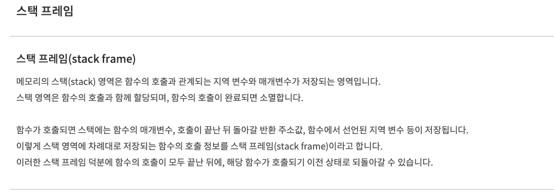
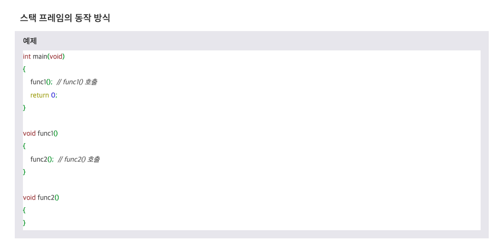
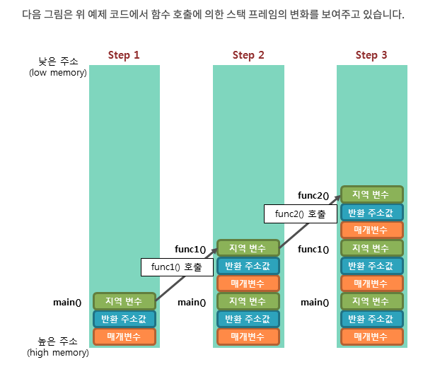
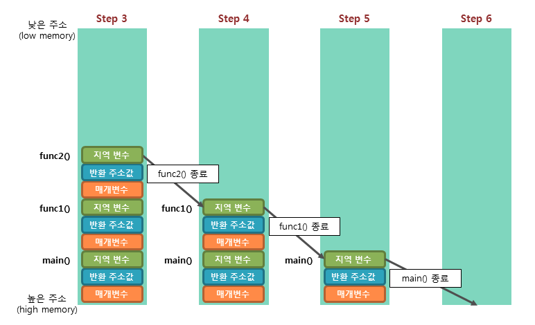
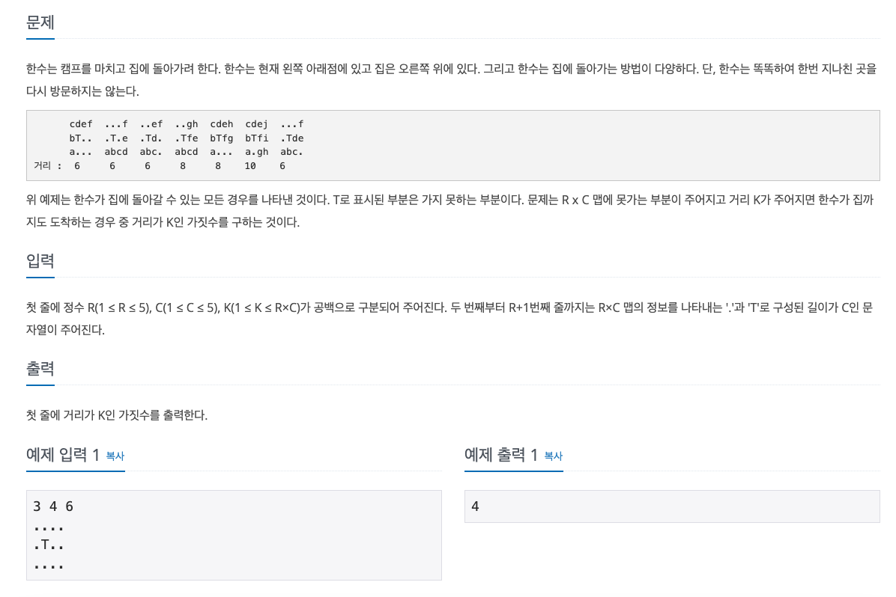
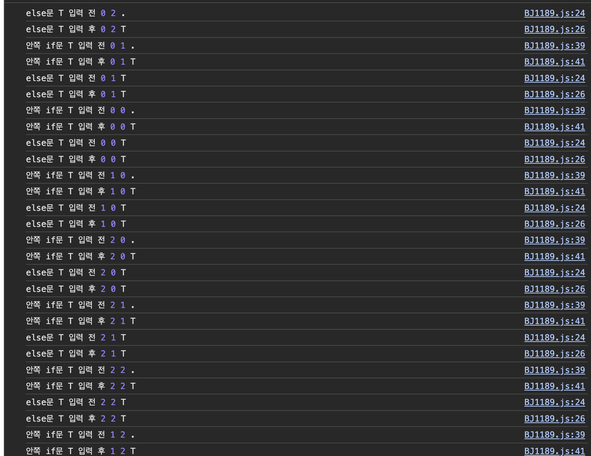

# 문제를 풀기 전 스택 프레임을 살짝 맛만..






- Step 1. 프로그램이 실행되면, 가장 먼저 main() 함수가 호출되어 main() 함수의 스택 프레임이 스택에 저장됩니다.
- Step 2. func1() 함수를 호출하면 해당 함수의 매개변수, 반환 주소값, 지역 변수 등의 스택 프레임이 스택에 저장됩니다.
- Step 3. func2() 함수를 호출하면 해당 함수의 스택 프레임이 추가로 스택에 저장됩니다.
- Step 4. func2() 함수의 모든 작업이 완료되어 반환되면, func2() 함수의 스택 프레임만이 스택에서 제거됩니다.
- Step 5. func1() 함수의 호출이 종료되면, func1() 함수의 스택 프레임이 스택에서 제거됩니다.
- Step 6. main() 함수의 모든 작업이 완료되면, main() 함수의 스택 프레임이 스택에서 제거되면서 프로그램이 종료됩니다.

```
이처럼 스택은 가장 나중에 저장된 데이터가 가장 먼저 인출되는 방식으로 동작합니다.
이러한 방식을 후입선출(LIFO, Last-In First-Out) 방식이라고 합니다.
이때 스택은 푸시(push) 동작으로 데이터를 저장하고, 팝(pop) 동작으로 데이터를 인출합니다.
```

---
# 문제



```
const input = `3 4 6
....
.T..
....`.split('\n');

const [R, C, K] = input.shift().split(" ").map(Number);
// 상 하 좌 우
let dx = [0, 0, -1, 1];
let dy = [1, -1, 0, 0];
// K가 몇번 나오는지 count 개수 (처음에 0으로 설정)
let result = 0;

let arr = [];
for (let i = 0; i < R; i++) {
    arr.push(input.shift().split(''));
}

// 깊이 우선 탐색으로 도착지 찍고 움직인 곳은 T로 메모리 스택에서 나올 때 .으로 바꿔주기
function dfs(x, y, cnt) {
    // 도착지는 오른쪽 끝이기 때문에 C - 1 하면 x축 y 는 y축을 뜻한다. 총 움직인 횟수가 K면 result 값을 1 증가.
    if (x === C - 1 && y === 0 && cnt === K) result += 1;
    else {
        // arr[y][x]는 이번에 움직이는 칸이기 때문에 T로 설정한다.
        console.log("else문 T 입력 전", x, y, arr[y][x]);
        arr[y][x] = 'T';
        console.log("else문 T 입력 후", x, y, arr[y][x]);

        // 상 하 좌 우로 움직일거임
        for (let d = 0; d < 4; d++) {
            let nx = x + dx[d];
            let ny = y + dy[d];

            // nx < 0 || ny < 0 || nx >= C || ny >= R는 ArrayIndexOutOfBoundsException을 일으키는 요소기 때문에 필터링 (즉 벽을 넘은 값들)
            if (nx < 0 || ny < 0 || nx >= C || ny >= R) continue;

            // 지금 위치에서 상 하 좌 우로 반복문을 돌건데 처음이라고 가정하면 상이 '.'인지 즉 움직일 수 있는 칸이면 if문 안으로 들어옴
            if (arr[ny][nx] === '.') {
                // 위쪽을 탐색한거기 때문에 움직이는 칸처럼 이동했다는 것을 표시 다시는 못오게
                console.log("안쪽 if문 T 입력 전", x, y, arr[ny][nx]);
                arr[ny][nx] = 'T';
                console.log("안쪽 if문 T 입력 후", x, y, arr[ny][nx]);
                // 체크한 상태로 위쪽으로 움직인 위치로 다시 처음부터 탐색함 => 위쪽에서 else문에 arr[y][x] = 'T';한 이유는 메모리 스택프레임이 생기면 참조하고 있는 상태가 각각 다르기 떄문이다.
                dfs(nx, ny, cnt + 1);
                // 위쪽으로 탐색했으니까 다시 원래대로 돌리고 다음에 밑으로 돌고 좌 -> 우로 반복하면서 최종 목적지를 찍으면 계속 리턴하는 방식으로 모든 함수가 호출이 종료되면 K번으로 도착한 횟수가 result에 찍힌다.
                arr[ny][nx] = '.';
            }
        }
    }
}

// 처음 움직이는 위치가 왼쪽 아래이기 때문에 x좌표는 0 y좌표는 맨밑으로 하기위해서 R - 1이다. count가 1인 이유는 처음 시작하는 위치를 세고 시작하기 때문
dfs(0, R - 1, 1);
console.log(result);
```
