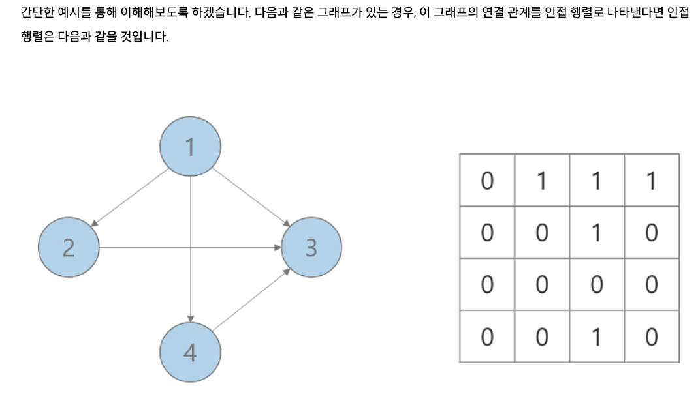
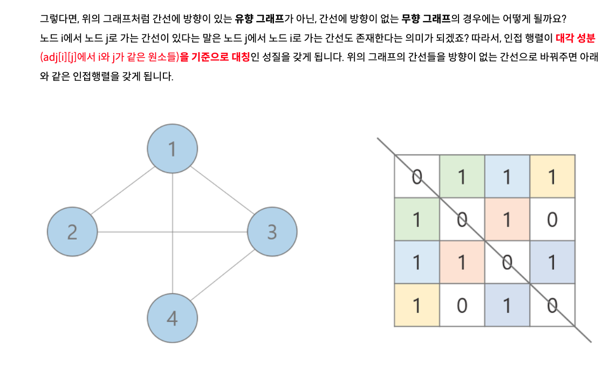
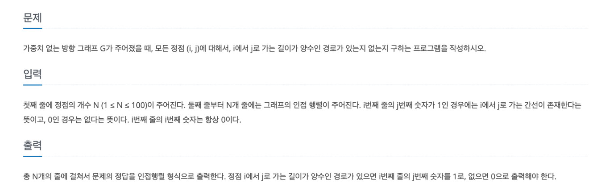
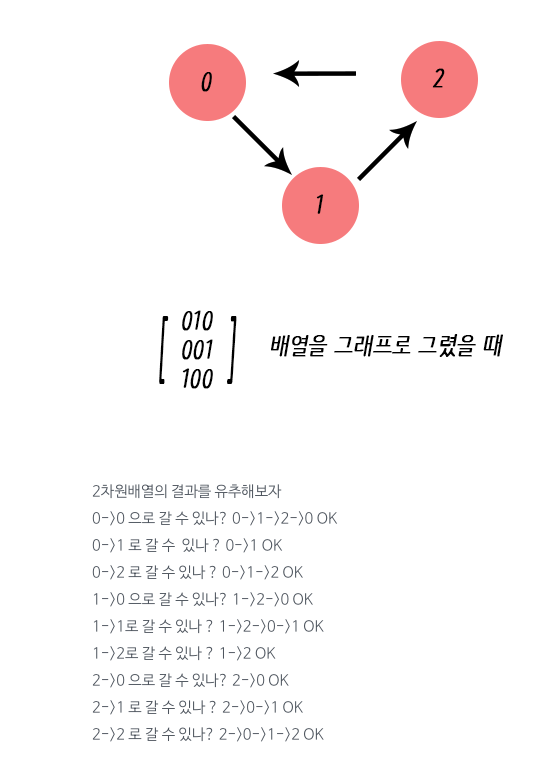
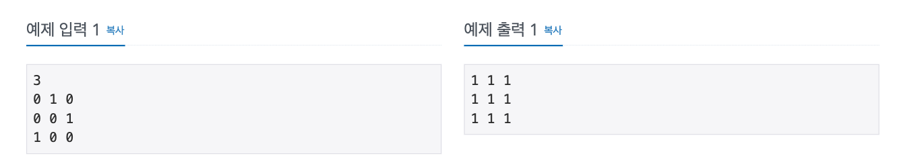
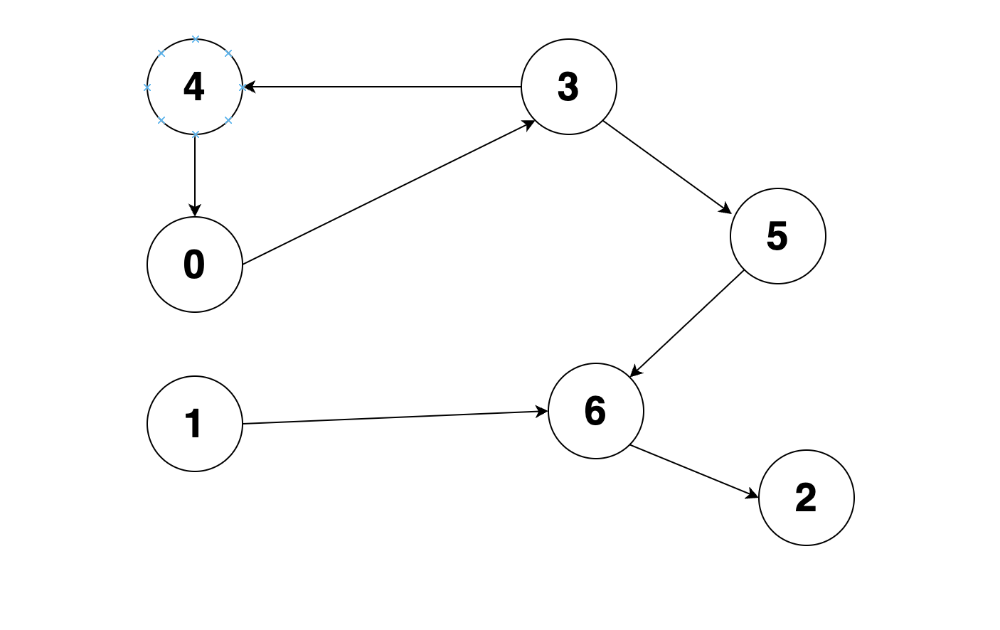
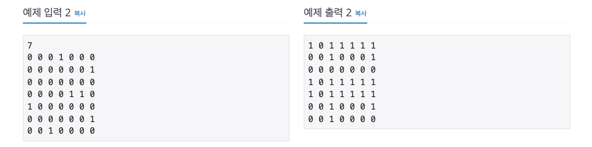
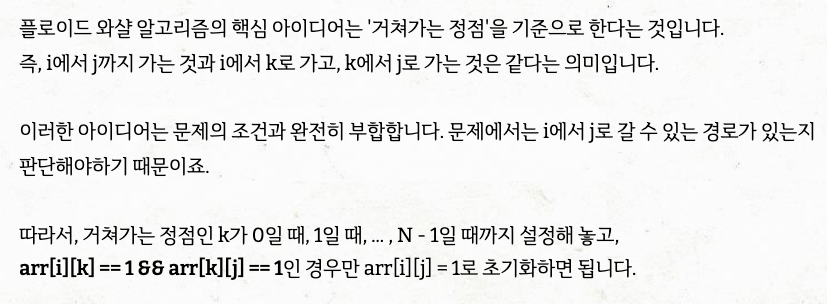
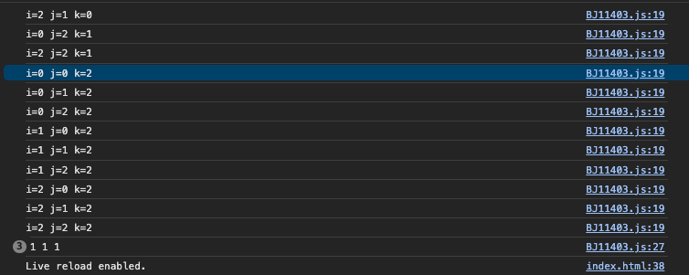

# 방향이 있는 그래프

# 방향이 없는 그래프

# 백준 11403번 경로 찾기

## 예제 입력 1번 설명

## 예제 입력 2번

### 플로이드 와샬 알고리즘

i = 출발 노드
j = 도착 노드
k = 거치는 노드 (k를 기준으로 확인하면 된다.)
그래서 if문이 arr[i][k] && arr[k][j]

- i에서 k로가는거랑 k에서 j로 가는게 있다면 okay

