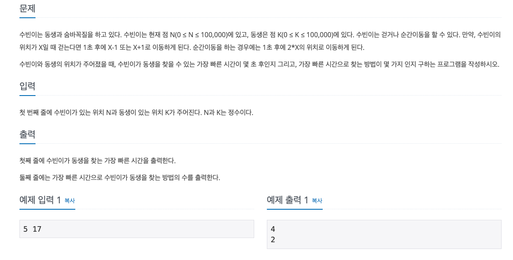

# 접근 방법 및 풀이

수빈이의 위치에서 동생의 위치로 -1, +1, \*2 일 경우로 이동해보면서 가장 빠른 시간으로 동생의 위치에 도착해야 한다.

## 핵심은 visit체크다.

단순히 위치한 곳에 visit[위치] = true해주면 안된다.

- 같은 위치라도 -1, +1, \*2일 때 다른 경로로 도착할 수 있기 때문이다. 그러면 경우의 수가 달라지므로 해당 위치를 visit[] 체크를 중복적으로 허용해주어야한다.
- -1, +1, \*2 니까 단순하게 visit[위치][3]으로 3가지의 경우에 따라 해당 위치에 도착하는 부분에 visit체크를 하는 경우 틀리게 된다.

## 반례

1 10을 해보면 된다. 정답은 4 2가 나와야 한다.
1 -> 2(+1) -> 4(*2)->5(+1)->10(*2)
1 -> 2(*2) -> 4(*2)->5(+1)->10(\*2)

- 경로를 살펴보면 2일때는 +1과 *2로 다른 방식으로 위치에 도착했지만, 4와 5일때는 *2, +1로 같은 방식으로 도착했기 때문에 visit[위치][3가지방법]으로 해서는 안된다.

## 해결법

해당 위치의 visit 체크를 시간으로 비교하자 (1초일 때 2초일 때 ...N)
어떤 위치에 방문할 때 동일한 시간으로 방문하는 애들은 카운트만 세주면 된다.

- 이 시간보다 늦은 시간에 도착하는 애들은 제외 (최단시간 안에 도착해야 하기 때문)

### 3 위치에서 2초만에 도착했다는 시간을 담는다.

visit 배열을 boolean이 아닌 int로 해서 해당 위치에 도착시간을 담는다. visit[3] = 2;

- visit배열을 도착한 시간으로 비교해서 풀이해주면 된다.
