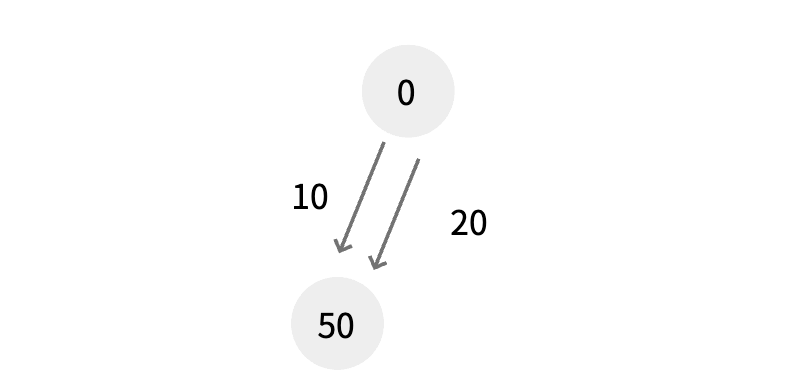
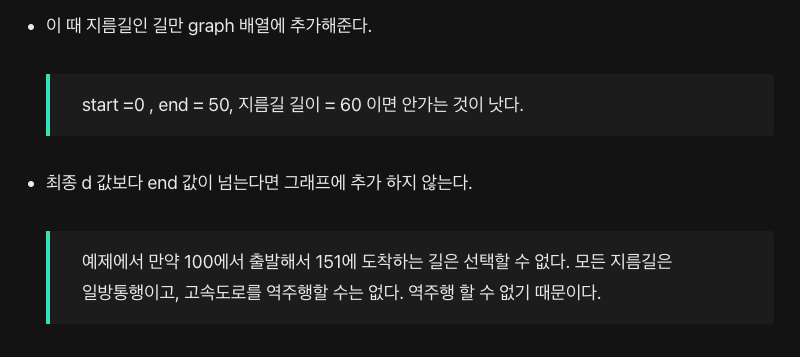
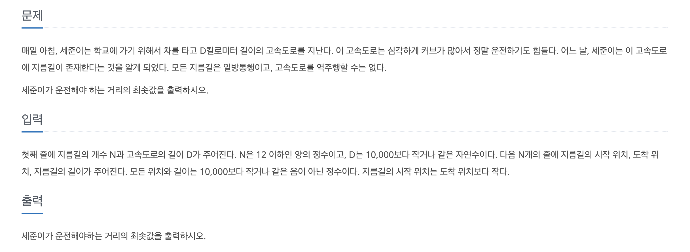
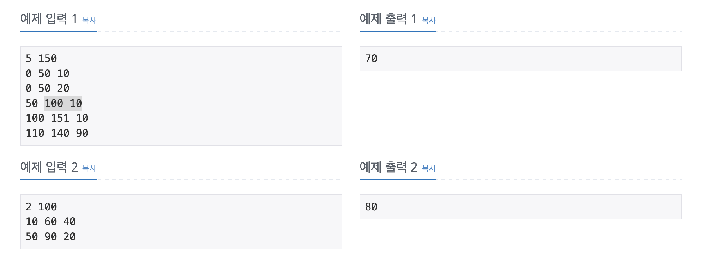

## 모든 지름길은 일방통행이고, 고속도로를 역주행할 수는 없다.

- 지름길이 있는 경우애만 그래프에 값을 넣어주기

- 그냥 가는게 지름길이랑 같거나 작으면 지름길을 넣을 필요가 없다.
- d 값보다 끝나는 종료지점이 클 경우 역주행 한 값만큼 빼줄 수 없기 때문에 건너 뛴다.

### dist 배열을 생성하여 0 부터 d 까지 순회한다.

prev = dist [i-1] 이다.

- 지름길을 이용하지 않는 방식은 dist[i-1] + 1 의 방법이다. , 즉 이전 최소 값에서 + 1한 값
- i에서 출발하는 지름길이 있다면 현재까지 온 거리 + 지름길의 거리(cost)를 더해서 dist[도착 지점] 보다 작다면 값을 갱신해준다.

